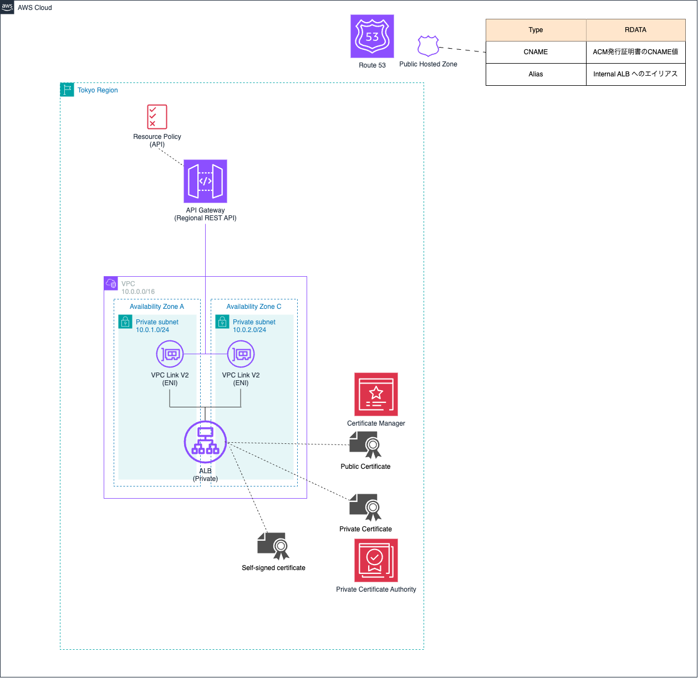

.. image:: ./doc/001samune.png

=====================================================================
Amazon API Gateway のプライベート統合トラフィックを HTTPS 化する方法
=====================================================================
* `詳細 <>`_

=====================================================================
構成図
=====================================================================

=====================================================================
デプロイ - Terraform -
=====================================================================

作業環境 - ローカル -
=====================================================================
* macOS Tahoe ( v26.2 )
* Visual Studio Code 1.108.2
* Terraform v1.14.1
* aws-cli/2.32.10 Python/3.13.9 Darwin/25.2.0 exe/arm64

フォルダ構成
=====================================================================
* `こちら <./folder.md>`_ を参照

前提条件
=====================================================================
* *AdministratorAccess* がアタッチされているIAMユーザーを作成していること
* 実作業は *envs* フォルダで実施すること
* 以下コマンドを実行し、*admin* プロファイルを作成していること (デフォルトリージョンは *ap-northeast-1* )

.. code-block:: bash
    
    aws login --profile admin

.. code-block:: bash
    
    sed -i '' '/^\[profile admin\]/a\
    credential_process = aws configure export-credentials --profile admin
    ' ~/.aws/config

事前作業(1)
=====================================================================
1. 各種モジュールインストール
---------------------------------------------------------------------
* `GitHub <https://github.com/tyskJ/common-environment-setup>`_ を参照

事前作業(2)
=====================================================================
1. *tfstate* 用S3バケット作成
---------------------------------------------------------------------
.. code-block:: bash
    
    aws s3 mb s3://terraform-working --profile admin

.. note::

  * バケット名は全世界で一意である必要があるため、作成に失敗した場合は任意の名前に変更

実作業 - ローカル -
=====================================================================
1. *backend* 用設定ファイル作成
---------------------------------------------------------------------

.. note::

  * *envs* フォルダ配下に作成すること

.. code-block:: bash
    
    cat <<EOF > config.aws.tfbackend
    bucket = "terraform-working"
    key = "aws-apigateway-private-integration-traffic-using-https/terraform.tfstate"
    region = "ap-northeast-1"
    profile = "admin"
    EOF

.. note::

  * *事前作業(2)* で作成したバケット名に合わせること

2. 変数ファイル作成
---------------------------------------------------------------------

.. note::

  * *envs* フォルダ配下に作成すること

.. code-block:: bash
    
    cat <<EOF > aws.auto.tfvars
    domain_name = "ドメイン名"
    public_hostedzone_id = "Route 53パブリックホストゾーンID"
    EOF

3. *Terraform* 初期化
---------------------------------------------------------------------
.. code-block:: bash
    
    terraform init -backend-config="./config.aws.tfbackend"

4. 事前確認
---------------------------------------------------------------------
.. code-block:: bash

    terraform plan

5. デプロイ
---------------------------------------------------------------------
.. code-block:: bash

    terraform apply --auto-approve

後片付け - ローカル -
=====================================================================
1. 環境削除
---------------------------------------------------------------------
.. code-block:: bash

    terraform destroy --auto-approve

2. *tfstate* 用S3バケット削除
---------------------------------------------------------------------
.. code-block:: bash

    aws s3 rm s3://terraform-working --recursive --profile admin
    aws s3 rb s3://terraform-working --profile admin

.. note::

  * *事前作業(2)* で作成したバケット名に合わせること

参考資料
=====================================================================
リファレンス
---------------------------------------------------------------------
* `terraform_data resource reference <https://developer.hashicorp.com/terraform/language/resources/terraform-data>`_
* `Backend block configuration overview <https://developer.hashicorp.com/terraform/language/backend#partial-configuration>`_

ブログ
---------------------------------------------------------------------
* `Terraformでmoduleを使わずに複数環境を構築する - Zenn <https://zenn.dev/smartround_dev/articles/5e20fa7223f0fd>`_
* `Terraformでmoduleを使わずに複数環境を構築して感じた利点 - SpeakerDeck <https://speakerdeck.com/shonansurvivors/building-multiple-environments-without-using-modules-in-terraform>`_
* `個人的備忘録：Terraformディレクトリ整理の個人メモ（ファイル分割編） - Qiita <https://qiita.com/free-honda/items/5484328d5b52326ed87e>`_
* `Terraformの auto.tfvars を使うと、環境管理がずっと楽になる話 - note <https://note.com/minato_kame/n/neb271c81e0e2>`_
* `Terraform v1.9 では null_resource を安全に terraform_data に置き換えることができる - Zenn <https://zenn.dev/terraform_jp/articles/tf-null-resource-to-terraform-data>`_
* `【Terraform🧑🏻‍🚀】tfstateファイルの分割パターンとディレクトリ構成への適用 <https://hiroki-hasegawa.hatenablog.jp/entry/2023/07/05/001756>`_
* `Terraformで自己署名証明書の作成からALBの適用までを一発で実施する - DevelopersIO <https://dev.classmethod.jp/articles/terraform-self-signed-certificate-alb-setup/>`_
* `aws login コマンドの認証情報で Terraform を実行する - Zenn <https://zenn.dev/yukit7s/articles/4a81811d64a200>`_
